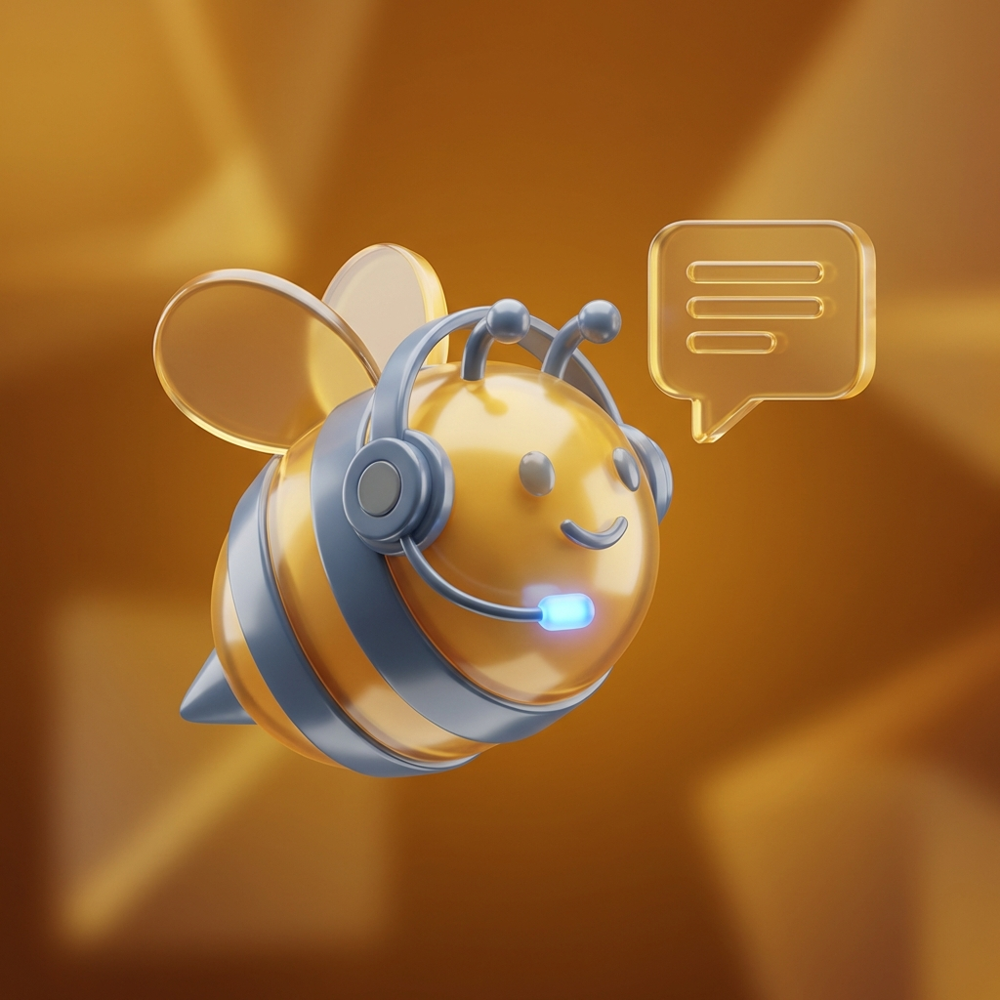

<div align="center">
  
  <h1>🐝 NotiBee</h1>
  <p><strong>The Ultimate Buzz for Your Social Life!</strong></p>

  <p>
    
    
    
    
  </p>
</div>

---

## 👋 Welcome to the Hive!

**NotiBee** is a fast, fun, and privacy-focused messaging application built with **Ionic**, **Vue 3**, and **Capacitor**. It’s designed to keep you connected with your "Hive" through ephemeral messages, real-time "Buzzes," and a unique distributed architecture that puts privacy first.

### ✨ What Makes it Un-bee-lievable?

- **💬 The "Buzz" System**: Real-time messaging that’s light as air. Messages (Buzzes) are ephemeral—delivered instantly and deleted from the database as soon as they are processed.
- **🏰 Hive Hubs**: Privacy-first group chats. There's no central room list; every member holds their own copy of the Hive, making it truly decentralized and secure.
- **📸 My Days**: Share your moments! A story-based feature to let your Hive know what's on your mind.
- **🎨 Bee Customizer**: Express yourself! Customize your bee avatar with unique eyes, wings, and accessories.
- **🍯 Honey Drops**: Earn rewards as you interact. Get "Honey Drops" for viewing stories, maintaining streaks, and buzzing your friends.
- **⚡ Supercharged Notifications**: Never miss a beat with a dual-layer notification system using FCM and local notifications.

---

## 🛠️ Tech Stack & Design

We believe in a premium, state-of-the-art experience.

- **Frontend**: [Ionic Framework](https://ionicframework.com/) + [Vue.js](https://vuejs.org/)
- **Build Tool**: [Vite](https://vitejs.dev/)
- **Backend**: [Firebase](https://firebase.google.com/) (Auth, Firestore, Cloud Functions, Messaging)
- **State/Logic**: [Capacitor](https://capacitorjs.com/) for native bridge
- **Styling**: 
  - **Glassmorphism**: Sleek, semi-transparent UI elements.
  - **Dark Mode**: Our primary and default experience.
  - **Golden Theme**: A vibrant #ffbf00 palette that feels alive.

---

## 🚀 Getting Started

Ready to join the Hive? Follow these steps:

### Prerequisites
- Node.js (Latest LTS)
- Ionic CLI (`npm install -g @ionic/cli`)
- A Firebase Project

### Installation

1. **Clone the repo**
   ```bash
   git clone https://github.com/mazi39662/NotiBee.git
   cd NotiBee
   ```

2. **Install dependencies**
   ```bash
   npm install
   ```

3. **Configure Firebase**
   - Add your `google-services.json` (Android) and `GoogleService-Info.plist` (iOS).
   - Update `src/firebase/config.ts` with your web config.

4. **Launch the Buzz**
   ```bash
   ionic serve
   ```

---

## 🏗️ Project Structure

```text
src/
├── assets/          # Static assets & bee parts
├── components/      # Reusable Vue components
├── services/        # Business logic (Buzz, Room, Honey, etc.)
├── views/           # Page components
├── theme/           # Global styles and variables
└── docs/            # Detailed implementation guides
```

---

## 🐝 Our Bee-laws (Guidelines)

We follow a strict set of architectural rules to keep the hive healthy:
1. **Be Ephemeral**: Don't keep data longer than needed. Delete processed notifications/messages.
2. **Be Decentralized**: Favor distributed storage over global collections.
3. **Be Fast**: Use `BuzzService` outbox patterns for smooth offline support.
4. **Be Golden**: Stick to the Amber/Slate design system.

---

<div align="center">
  <p>Made with ❤️ and plenty of 🍯</p>
  <p><strong>Buzz on!</strong></p>
</div>
